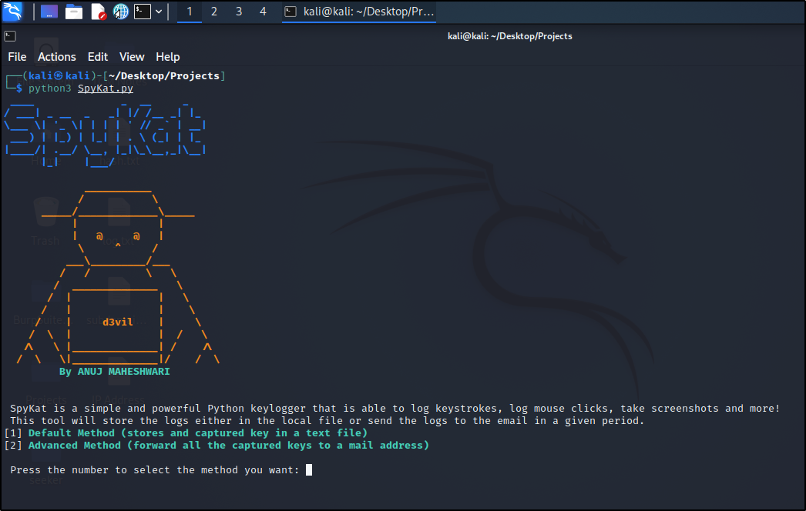

<h1 align="center"> SpyKat </h1>

<div align="center">
  
  
  
  
  

</div>



## Description
A keylogger created for the Windows operating system records the target's connection information, device system information, the operating system's list of currently active processes and services, keyboard key records, copy-paste clipboards, and screenshots, and it sends the information to the specified email address at predetermined intervals.


## Installation \& Use
```
python3 -m pip install -r .\requirements.txt

python3 SpyKat.py
```
